# 머신러닝을 활용한 비트코인 가격동향 예측 

### 1. 서론
   #### 1.1 요약 
    - 최근 비트코인에 대한 관심이 점점 더 증가하고 있다. 때문에 이 비트코인 가격을 예측하기 위한 다양한 시도와 연구가 있어왔지만, 정확한 비트코인 가격에 대한 예측은 불가능하였다.
    - 본 연구의 목표는 비트코인의 가격을 어느정도 예측하여 투자자들이 판매 혹은 구입을 선택하는데 도움을 주고자 하는 것이다. 우선, 비선형성 특성을 가지면서 이전 가격의 영향이 현재 가격에 영향을 주는 특성을 가진 비트코인 가격을 예측하기 위해 모델을 선정하는 것을 첫 번째로 하고, 이전 날짜들의 시가, 종가와 함께 그 날들에서의 수급,공급 요인인 KOSPI지수, 순 매수 비율과 비트코인 거래량과 실물 경제 요인인 실업률, 심리적 요인으로 네이버 트렌드 지수를 입력변수로 사용하였다. 이 입력 변수들로 모델들을 학습한 뒤에 각 모델을 평가하여 최적의 모델을 결정하고, 그 모델의 최적의 모델 파라미터를 산출한 뒤, 테스트 데이터를 활용하여 이 모델의 최종 비트코인 가격 예측 성능을 평가한다.
   #### 1.2 키워드 : 비트코인, 가격 예측, 기계학습, 지도학습, RNN, LSTM, GRU
 

### 2. 비트코인 데이터
   #### 2.1 데이터 수집 및 처리 
      - 본 연구에서는 국내의 빗썸에서 거래되고 있는 비트코인들의 종가, 시가와 거래량에 대한 데이터를 investing사이트를 통해 구하였다. 비트코인 가격에 대한 데이터의 기간은 2017년 05월 23일부터 2021년 07월 06일이고, 이 데이터들을 분리하여 2017년 05월 23일부터 2021년 02월 28일의 데이터들(1378일)을 training data 집합으로 하고, 2021년 03월 01일부터 2021년 07월 06일까지의 데이터들(128일)을 test data 집합으로 하였다. 
      - 그리고 다른 변수들을 사용하기 위해서 비트코인 가격이 일별로 저장되어있기 때문에 다른 변수들 또한 일별로 맞추었다. 코스피 지수와 실업률 같은 경우는 e-나라지표에서 구하였고, 순 매수 비율은 코스피 사이트에서 구하였다. 네이버 트렌드 지수는 네이버에서 제공하는 Datalab을 이용하여 얻었다. 
      - Table 1. Example of Collected Data  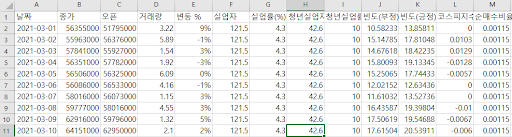
      - 데이터들의 차이가 크기 때문에 MinMaxScaler를 사용하여 정규화된 데이터들을 사용한다. Table1은 정규화 되기 전 1일 단위로 기록된 비트코인의 종가, 시가, 거래량과 기타 다른 변수의 값들의 일부를 보여준다. 
  #### 2.2 비정상 데이터 처리 
      - 실험에 사용된 데이터 중 실업률 이나 순매수 비율, 실업자 수 같은 경우에는 데이터가 일별이 아닌 월별으로 되어있다. 이 월별 데이터를 일별로 맞추기 위해서 데이터들을 복사하여 날짜를 맞추었다. 또한 코스피 같은 경우 휴장일이 있기 때문에 그 날의 코스피 지수 같은 경우 0으로 맞추었다.

### 3. 기계학습 모델
   #### 3.1 모델 선정
      - 본 연구는 LSTM을 활용하지만, 모델에 대한 다양한 연구와 학습을 위해 ARIMA, Prophet 모델의 성능도 비교해보았다. 학습 및 테스트 데이터는 앞선 절에서 수집 및 전처리 과정을 거친 데이터를 활용한다.
  #### 3.2 ARIMA
      - ARIMA는  자기회귀와 이동평균을 둘 다 고려하고, 시계열의 비정상성을 설명하기 위해 관측치간의 차분을 이용하는 모형이다. ARIMA는 AR, I, MA로 나눌 수 있는데, AR는 이전 관측 값의 오차항이 이후 관측 값에 영향을 주는 모형이고, I는 누적을 의미하고, MA는 관측 값이 이전의 연속적인 오차항의 영향을 받는다는 모형이다. 현실에 존재하는 시계열 자료는 비정상성을 갖는데, AR이나 MA 모형만으로는 이 비정상성을 설명할 수 없다. 따라서 모형 자체에서 이런 비정상성을 제거하는 과정을 포함한 것이 ARIMA 모형이다.
      - 위 모델은 입력 변수로 종가 하나만을 이용하여 비트코인의 가격을 예측할 수 있고, 그 성능은 다음의 Graph1에서 볼 수 있다.
      - Graph1. ARIMA 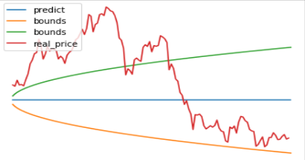

   #### 3.3 Prophet
      - 페이스북에서 개발한 시계열 예측 모델이다. Prophet 모델의 주요 구성요소는 Trend, Seasonality, Holiday이다. 공식으로 나타내면 y(t)=g(t)+s(t)+h(t)+e로 표현할 수 있는데, g(t)는 주기적이지 않은 변화를, s(t)는 주기적으로 나타나는 패턴을, h(t)는 불규칙한 사건들을 나타낸다. e는 정규분포라고 가정했을 때의 오차이다.
      - 위 모델은 입력 변수로 종가 하나만을 이용하여 비트코인의 가격을 예측할 수 있고, 그 성능은 다음의 Graph2에서 볼 수 있다.
      - Graph2. Prophet 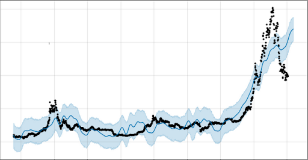

   #### 3.4 LSTM
      - 장단기메모리(Long Short-Term Memory, LSTM)은 훈련이 빠르게 수렴되고 데이터의 장기간 의존성을 감지하는데, 아직까지 RNN을 개선한 가장 성공적인 모델로 평가받고 있다. LSTM은 장기 의존성을 해결하기 위해서 셀 상태(Cell state)라는 구조를 만들었다. 데이터를 계산하는 위치에 입력(Input), 망각(Forget), 출력(Output) 게이트 3가지가 추가되어 각 상태값을 메모리 공간 셀에 저장하고, 데이터를 접하는 게이트 부분을 조정하여 불필요한 연산, 오차 등을 줄여 장기 의존성 문제를 일정 부분 해결한다. 
      - Forget Gate Layer 는 과거의 정보를 버릴지 말지 결정하는 게이트이며, Sigmoid 활성화 함수를 통해 0~1 사이의 값을 출력한다.  Input Gate Layer 는 새로운 정보가 Cell State에 저장이 될지를 결정하는 게이트이다.  Output Gate Layer는 상태를 바탕으로 Sigmoid 층에 input 데이터를 태워 상태의 어느 부분을 출력으로 내보낼지 결정하는 게이트다.  Update Cell State는 Forget gate와 Input gate 에서 출력된 값들을 Cell State로 업데이트한다.
      - 본 연구에서는 위에서 전처리된 종가, 시가, 거래량, 변동량, 실업자, 실업률, 청년 실업자, 청년 실업률, 빈도(부정), 빈도(긍정), 코스피 지수 변화, 순 매수 비율을 입력 feature 로 사용한다.(총 12개) 또한, 이전 값들을 얼만큼 참조하는 지를 나타내는 하이퍼파라미터 timestep을 5로 설정한다. loss 함수는 mae를 사용하고, optimizer는 adam으로 설정하였다. 
      - 이후 하이퍼파라미터에 다양한 변수를 적용해가며 모델의 성능을 개선하고자 했으며, 관련 내용은 다음 절에서 자세히 서술한다. Graph3은 time step은 5, hidden layer를 1개로 설정하여 임의로 추출한 결과이다.
      - Graph3. LSTM 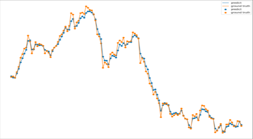

  ### 4. 실험 평가
#### 4.1 성능 평가 지표
       -  RMSE, RMSE 는 크게 벗어난 오차에 조금 더 패널티를 부여하는 방식으로 작동하기 때문에 크게 잘못 예측한 모델에 큰 값을 반영할 수 있다.
#### 4.2 실험 환경
         - LSTM의 입력변수로는 total_data_set에 만들어 둔 경제지표 들과 비트코인의 일별 시가,종가, 변동률 자료를 이용한다. 2021년 3월 1일 전까지 학습한 LSTM모델을 2021년 3월 1일 이후의 테스트 데이터에 적용하는 실험한다. 

#### 4.3 epoch 에 따른 비교
         - 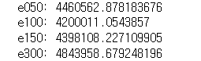
         - time step=5, batch_size=64, input_node = 64, layer=1의 환경에서 epoch를 실험한 실험값이다.
         - epoch 100이후에는 크게 성능이 좋아 지지 않으며 오히려 RMSE 증가할 수 있음을 알 수 있다.해당 실험결과를 바탕으로 100에서 150사이의 값을 한번 더 실험해볼 것이다.
      
#### 4.4 timestep 에 따른 비교
         - 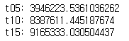
         - epoch=100, batch_size=64, input_node = 64, layer=1의 환경에서 timestep을 실험한 실험값이다.
         - timestep 5와 10은 차이가 크게 벌어지게 되는 것 알 수 있다.
         
#### 4.5 batch size 에 따른 비교
         - 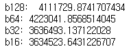
         - time step=5, epoch = 100, input_node = 64, layer=1 의 환경에서 batchsize를 실험한 실험값이다.
         -  RMSE값으로만 비교하면 batchsize=32일때가 더 좋은 성능을 보였다.

#### 4.6 node 수에 따른 비교
         - 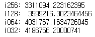
         - batchsize = 64, time step=5, epoch = 100, layer=1, 의 환경에서 input_node를 실험한 실험값이다.
         - 배치사이즈와 노드수 실험 결과를 바탕으로 최종 결과에는 input_node를 기존 실험환경보다 높이고자 한다.

#### 4.7 활성화함수에 따른 비교
         - 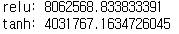
         - lstm에서는 활성화함수로 기본으로 tanh를 사용한다. 빅데이터분석 수업에서 배운 relu를 사용하여 비교해봅니다. 
         - batchsize = 64, time step=5, epoch = 100, layer=1, input_node=64의 환경에서 를 활성화함수를 실험한 실험값이다.
#### 4.8 Layer
         - 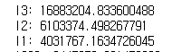
         - batchsize = 64, time step=5, epoch = 100, input_node=64의 환경에서 layer를 더해 스택을 만들어 실험한 실험값이다.
         - 레어어가 1일때가 성능이 좋음을 알 수 있다.

#### 4.9 GRU
         - 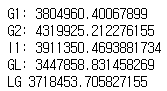
         - batchsize = 64, time step=5, epoch = 100, input_node=64의 환경에서 실험한 실험값이다.
         - GRU도 좋은 결과를 보여주고 속도가 빠르다. 또한 GRU와 LSTM을 혼재하면 의외로 GRU이후 LSTM으로 스택을 만들었을 때도 좋은 결과를 볼 수 있음을 있다.
    

   ### 6. 결과 분석
      1. 위 결과를 모두 종합해 볼 때 가장 좋은 결과를 보인 경우는 time step=5, activation_function = Tanh, batch_size=64, node = 256, LSTM  layer=1, epoch = 130일 때가 가장 좋은 결과를 보였다.
         - 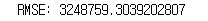
         - 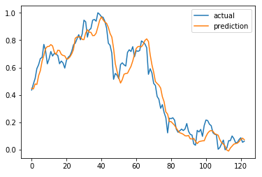
         - 128일의 데이터를 예측한 결과이다. 최종적으로 지난 5일간의 데이터로 익일의 값을 예측을 하는 것이 완료가 되었다. 
      2. 만일 우리가 이 데이터를 바탕으로 투자를 시도하면 이익을 얻을 수 있을까? 
         - 아쉽게도 우리가 알 수 있는 정보량은 5일 전의 데이터부터 오늘까지의 데이터를 학습시켜서 내일의 종가를 예측할 수 있는 것이 한계이다. 
         - 왜냐하면 우리가 알 수 있는 익일의 데이터는 종가 하나 뿐이고 우리가 예측하는 것에 필요한 input data의 열은 11개이기 때문이다.

### 7. 결론 
      - 현재 다변량 예측을 하는 것에 있어서 장점은 종가의 예측값에 상관관계가 있는 다양한 변수를 활용해서 단지 전날의 종가를 입력 받아 시계열이 가지고 있는 법칙성을 통해 예측하는 모델 보다 신뢰성이 높다고 판단할 수 있다. 또한 경제적 요인과 심리적 요인의 영향이 크고 그에 따라서 통계적 특성이 변하는 경향, 비정상성이 큰 데이터이기 때문에 다양한 변수들을 사용하는 것이 더욱 합당하다. 
      - 또한 test data에서 등락에 대한 새로운 data를 추출해내어 높은 정확도를 기록했다. 물론 이 것을 실제 매매에 적용하는 문제에 대해서는 꽤 오랜 시간 검증을 해야하는 과정이 필요해 보인다. 
      - 하지만 LSTM이 정확한 비트코인의 값을 예측하기에는 non stationary한 비트코인의 가격이 너무나도 랜덤하게 움직이고, 예측하려는 값이 실수인 부분, 익일의 값만을 알 수 있는 다변량 LSTM 모델의 예측에는 한계가 있다는 것을 알 수 있었다. 
      - 이를 보완하기 위해 직접적인 비트코인의 가격을 유추하기 보단 단순히 미래의 비트코인의 가격이 상승할지 하강할지에 대한 clssifier 모델로 만든다면 유추하는 것이 줄어들어 더 좋은 예측 성능을 보여줄 것이고, 이 모델 또한 투자자들에게 좋은 투자 선택의 옵션이 될 수 있을 것이다. 
      - 이를 고려하여 실제 classifier 모델을 만들었지만, 기대했던 것보단 실제 예측 성능은 좋지 않았다. 이를 개선하기 위해 추후 연구에는 개선된 비트코인 가격에 영향을 미치는 feature들을 더 선별하는 등의 행동이 필요하다.
 

### 8. References
      1. Sun Woong Kim, 딥러닝을 이용한 비트코인 투자전략의 성과 분석, Journal of the Korea Convergence Society Vol.12. No. 4, pp 249-258, 2021 
      2. Joo-Seong Heo⋅Do-Hyung Kwon⋅Ju-Bong Kim⋅Youn-Hee Han, 그래디언트 부스팅을 활용한 암호화폐 가격 동향 예측, KIPS Trans.Softw. and Data Eng Vol.7. No.10, pp 387-396, 2018 
      3. Han-Min KIM⋅Hoik KIM, 머신러닝 기법을 활용한 암호화폐 유통 가격 예측 연구, Journal of Distribution Science Vol 10 No 11, pp 93-101, 2019

